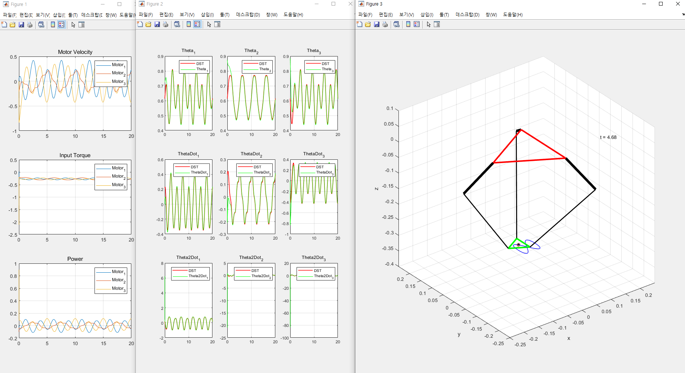

# The Current-Position Cascade PID Control of Delta-type Parallel Robot

  

The URLs listed below are useful for understanding this repository:
* <a href="https://scienceon.kisti.re.kr/commons/util/originalView.do?cn=JAKO202012764216515&dbt=JAKO&koi=KISTI1.1003%2FJNL.JAKO202012764216515"> Paper </a>
* <a href="https://www.youtube.com/shorts/6-I6i4Fmoyc"> The video clip that shows the delta robot simulation </a>

TODO
1. Upload control code
2. Upload the videoclip of constructed robot
3. Upload the control codes of the robot
